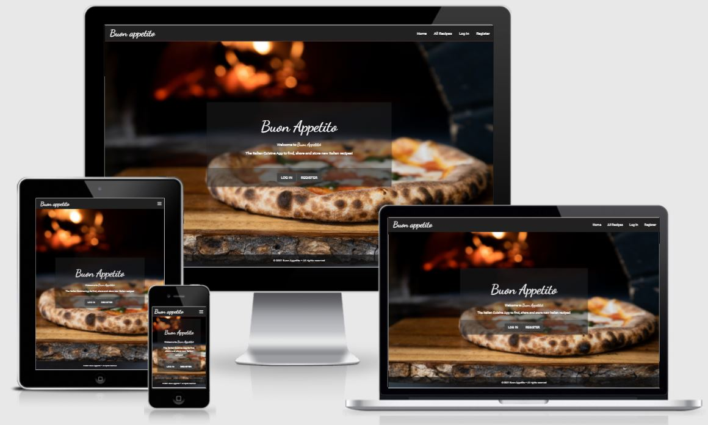
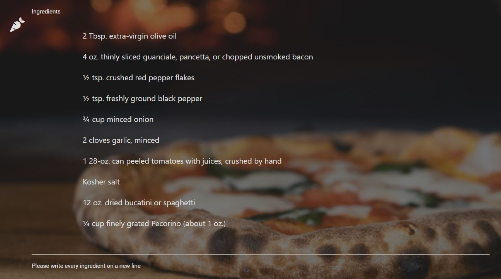
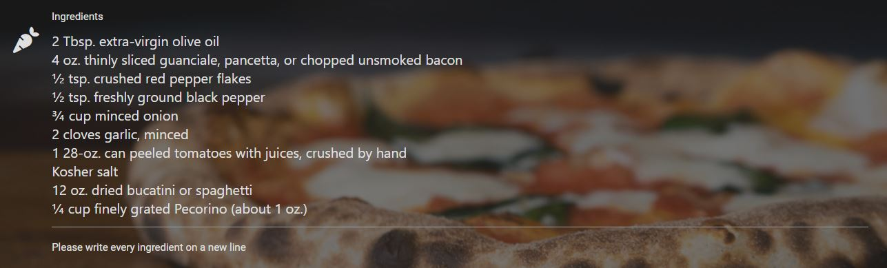
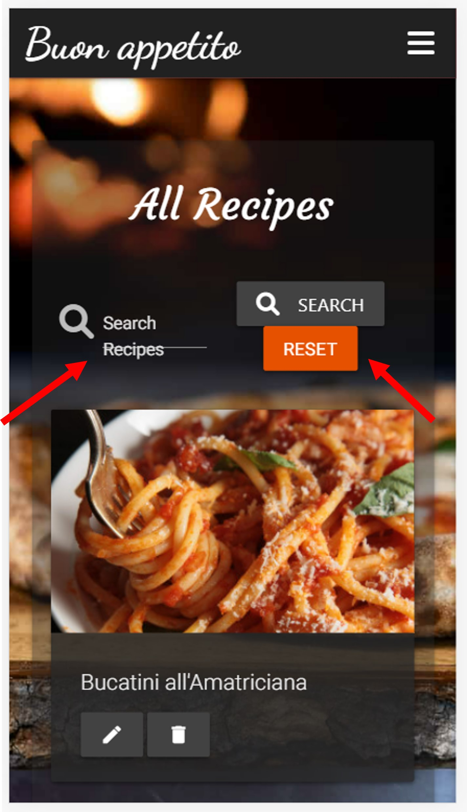

# Buon Appetito Website

View the live project [Here](https://italian-cuisine-app.herokuapp.com/)

*Buon Appetito* is an interactive website that allows to collect and share recipes of Italian cuisine meal.

The website is designed to be responsive and accessible on a range of devices, making it easy to navigate through.



## User Experience (UX)

### User stories

  - **As a user:**

    - I want to search for different recipes and get inspiration to try something new.
    - I want to be able to create my own recipes and store them in my profile. 
    - I want to orgnize my recipes (to create, edit or delete recipes).
    - I want to share my own recipes with others.

  - **As an owner of a website**

    - I want to promote the products. 
      
### Design

  - **Colour Scheme**

    The main colours used are dark grey #212121, white #FFFFFF and grey #424242.

  - **Typography**

    The Roboto, Dancing Script (Navbar heading) and Courgette (titles) fonts are the main fonts used throughout the whole website with Sans Serif and cursive as the fallback fonts in case for any reason the font isn't being imported into the site correctly. Roboto is a clean font used frequently in programming, so it is both attractive and appropriate.

  - **Imagery**
     
    The large background image is striking and catches the user's attention. All other images on the site are the image URLs added by users when creating their recipes.

### Wireframes

  - *Home* page - [View](static/pdf/home-page.pdf)

  - *All Recipes* page - [View](static/pdf/all-recipes.pdf)

  - *Profile* page - [View](static/pdf/profile.pdf)

  - *Add New Recipe* page - [View](static/pdf/add-new-recipe.pdf)

  - *Log In* page - [View](static/pdf/log-in.pdf)

  - *Register* page - [View](static/pdf/register.pdf)

## Features

### Existing Features

- The website is responsive on many device sizes (down to 280 px).

- The website allows users to Create, Read, Update and Delete recipes. This displays full CRUD functionailty.

- Any user can:

  - register an account,
  - log in as an existing user,
  - log out,
  - view his profile page with a list of recipes that have been added,
  - view, edit and delete recipes,
  - see which user has created any particular recipe.

### Features Left to Implement

- recipes rating

- the posibility to leave a comment on a recipe

- admin login functionality to edit or delete recipes added by other users (in case of incorrect or inappropriate information)

- advertisment integration (to promote any branded product in the recipes description)

- a *Scroll to top* button

- contact page


## Technologies Used

### Languages Used

- HTML5

- CSS3

- Python3

- JavaScript

### Frameworks, Libraries & Programs Used

1. [Materialize:](https://materializecss.com/)

   Grid System to make the site responsive,

   Navbar to make a responsive navigation header,

   Cards components for displaying recipes.

2. [MongoDB:](https://www.mongodb.com/)

   MongoDB was used to store recipes and users data.

3. [Heroku:](https://id.heroku.com/login)

   Heroku was used to deploy and run the application.
   
4. [Flask:](https://flask.palletsprojects.com/en/2.0.x/)

   Flask was used as a framework to develope a web application.

5. [Jinja:](https://jinja.palletsprojects.com/en/3.0.x/)

   Jinja was used to render templates.

6. [PyMongo:](https://pymongo.readthedocs.io/en/stable/)

   PyMongo was used to to work with MongoDB from Python.

7. [Werkzeug:](https://pypi.org/project/Werkzeug/)

   Werkzeug was used to generate and check password hash.

8. [jQuery:](https://jquery.com/)

   jQuery was used in JavaScript codes to add functionality to materialize compontents.

9. [Git:](https://git-scm.com/)

   Git was used for version control. 

10. [GitPod:](https://www.gitpod.io/)

    GitPod was used as an IDE platform for website realization.

11. [GitHub:](https://github.com/)

    GitHub is used to store the project code after being pushed from GitPod.

12. [Google Fonts:](https://fonts.google.com/)

    Google fonts Roboto, Dancing Script and Courgette were used on all pages throughout the project.

13. [Balsamiq:](https://balsamiq.com/)

    Balsamiq was used to create wireframes during the design process.

14. [Squoosh:](https://squoosh.app/editor)

    Squoosh image editor was used to reduces file size of the images.

15. [Am I responsive?:](http://ami.responsivedesign.is/)

    Am I responsive? was used to show how the website looks on different devices.

16. [Font Awesome:](https://fontawesome.com/)

    Font Awesome was used to add icons.

17. [AutoPrefixer:](https://autoprefixer.github.io/)

    AutoPrefixer was used to add vendor prefixes to a CSS code.

18. [Beautifier:](https://beautifier.io/) 

    Beautifier was used to format code in a consistent and readable way.

19. [W3C Markup Validator](https://validator.w3.org/)

    W3C Markup Validator was used to check the markup validity of Web documents in HTML.

20. [W3C CSS Validator](https://jigsaw.w3.org/css-validator/)
 
    W3C CSS Validator was used to check the markup validity of Web documents in CSS.

21. [JSHint](https://jshint.com/)

    JSHint was used to detect errors and potential problems in JavaScript code.

22. [Chrome DevTools](https://developer.chrome.com/docs/devtools/)

    Chrome DevTools was used to inspect and modify the website code.

23. [Lighthouse](https://developers.google.com/web/tools/lighthouse)

    Lighthouse was used to assess performance, accessibility, SEO and best practices.

24. [PEP8 online](http://pep8online.com/)

    PEP8 online was used to check a code for PEP8 requirements.

## Testing

The W3C Markup Validator, W3C CSS Validator and JSHint Services were used to validate HTML, CSS and JS code, respectively, to ensure no syntax error.

- [W3C Markup Validator](https://validator.w3.org/). Please see the results of base.html validation [Here](static/pdf/w3c-markup-validator.pdf). All errors were associated with a Jinja syntax.
- [W3C CSS Validator](https://jigsaw.w3.org/css-validator/). Please see results in W3C CSS Validator:

  
- [JSHint](https://jshint.com/) did not detect any problem in JavaScript codes.

### Testing User Stories from User Experience (UX) Section

Please see [Here](testing_user_stories.md) the user stories testing with corresponding screenshots.

### Testing Functionality, Usability and Responsiveness

The manual testing is described [Here](manual-testing.md).

### Further Testing

- The website was checked for performance in [Lighthouse](https://developers.google.com/web/tools/lighthouse) in Chrome DevTools (see results in Figure S3 in [Supp Info](supp-info.md)).

- The Website was tested on Google Chrome, Mozilla Firefox and Microsoft Edge browsers.

- The screen sizes and devices tested in Chrome DevTools include:

    - 1920 x 1080 
    - 1600 x 992
    - 1440 x 900
    - 1366 x 768
    - 1280 x 800
    - Nexus 10 (800 x 1280)
    - iPad (768 x 1024)
    - Surface Duo (540 x 720)
    - iPhone 6/7/8 Plus (414 x 736)
    - Pixel 2 (411 x 731)
    - iPhone 6/7/8 (375 x 667)
    - Nexus 4 (384 x 640)
    - iPhone X (375 x 812)
    - Galaxy S5 (360 x 640)
    - iPhone 5/SE (320 x 568)
    - Galaxy Fold (280 x 653)

- Devices physically tested include:

  - Desktop 
  - Laptop
  - iPhoneXR 
  - Huawei Mate 20 
    
### Bugs

#### Fixed bugs

1. On *Edit Recipe* page, the *ingredients* and *preparation steps* sections were displayed as lists of items (see example in the image below) with additional left-side spaces and new lines (undesired). That was introducing further issues with the correct editing of data in the database.

    The initial code was rewritten using `join()` function and hyphen signs. `join()` function returns a string as a concatenation of strings in a sequence with a chosen separation (new line separation in our case). Hyphen signs (-) added to the start or end of a block remove the whitespaces before or after that block.

    Initial code:
      ```
      
        {{ ingredient }}
      
      ```
      

    Final code:
      ```
      {{- recipe.ingredients|join('\n') -}}
      ```
      

2. The two elements indicated with red errors (search fiels and buttons) in the image below have *Materialize* classes *s12* and should have occupied all the avalable row space in mobile devices. Instead they were placing in one row.

    Initial code:
      ```
      <div class="row valign-wrapper center-align">
        <div class="input-field col s12 l6 xl8">
            <i class="fas fa-search prefix grey-text text-lighten-1"></i>
            <input type="text" name="query" id="query" minlength="3" class="validate" required>
            <label for="query">Search Recipes</label>
        </div>
        <div class="col s12 l6 xl4">
            <button type="submit" class="white-text grey darken-3 waves-effect waves-light btn">
                <i class="fas fa-search left"></i> Search
            </button>
            <a href="{{ url_for('get_recipes') }}" class="white-text orange darken-4 waves-effect waves-light btn">Reset</a>
        </div>
      </div>
      ```
      
    
    Final code:

#### Existing bugs

1. 
        
## Deployment

### GitHub Pages

The project was deployed to GitHub Pages using the following steps:

1. Log in to GitHub and locate the [GitHub Repository](https://github.com/).

2. At the top of the Repository (not top of page), locate the "Settings" Button on the menu.

3. Scroll down the Settings page until you locate the "GitHub Pages" Section.
    
4. Under "Source", click the dropdown called "None" and select "Master Branch".
    
5. The page will automatically refresh.
    
6. Scroll back down through the page to locate the now published site link in the "GitHub Pages" section.

### Forking the GitHub Repository

By forking the GitHub Repository we make a copy of the original repository on our GitHub account to view and/or make changes without affecting the original repository by using the following steps:

1. Log in to GitHub and locate the [GitHub Repository](https://github.com/).
    
2. At the top of the Repository (not top of page) just above the "Settings" Button on the menu, locate the "Fork" Button.

3. You should now have a copy of the original repository in your GitHub account.

### Making a Local Clone

1. Log in to GitHub and locate the [GitHub Repository](https://github.com/).
    
2. Under the repository name, click "Clone or download".
    
3. To clone the repository using HTTPS, under "Clone with HTTPS", copy the link.
    
4. Open Git Bash.
    
5. Change the current working directory to the location where you want the cloned directory to be made.
    
6. Type `git clone`, and then paste the URL you copied in Step 3.

    ```
    $ git clone https://github.com/YOUR-USERNAME/YOUR-REPOSITORY
    ```

7. Press Enter. Your local clone will be created.

   ```
   $ git clone https://github.com/YOUR-USERNAME/YOUR-REPOSITORY
   > Cloning into `CI-Clone`...
   > remote: Counting objects: 10, done.
   > remote: Compressing objects: 100% (8/8), done.
   > remove: Total 10 (delta 1), reused 10 (delta 1)
   > Unpacking objects: 100% (10/10), done.

Click [Here](https://docs.github.com/en/github/creating-cloning-and-archiving-repositories/cloning-a-repository#cloning-a-repository-to-github-desktop) to retrieve pictures for some of the buttons and more detailed explanations of the above process.


## Credits

### Content

#### Images

- Favicon image was taken from [Iconduck](https://iconduck.com/emojis/15944/slice-of-pizza)

- Background image was taken from [Unsplash](https://unsplash.com/photos/40OJLYVWeeM)

- Bucatini all'Amatriciana image was taken from [BigOven](https://www.bigoven.com/recipe/bucatini-allamatriciana/2435565)

- Spaghetti alla carbonara image was taken from [Recepten.be](https://recepten.be/recept/authentieke-spaghetti-carbonara/)

- Pizza Margherita image was taken from [Indoindians](https://www.indoindians.com/so-simple-and-so-good-pizza-margherita/)

- Tiramisu image was taken from [La Rosiere](https://www.larosiere.net/tiramisu-recette/)

- Cannoli Siciliani image was taken from [Home Cooking Adventure](https://www.homecookingadventure.com/recipes/cannoli-siciliani)

- Vitello tonnato image was taken from [LINDENHOFF](https://www.lindenhoff.nl/recepten/vitello-tonnato/)

- Lasagna alla Bolognese image was taken from [PASTAFICIO](https://www.pastaficio.nl/alles-wat-je-moet-weten-over-lasagne/)

- Saltimbocca alla Romana image was taken from [Cibovagare](https://www.cibovagare.it/ricette/saltimbocca-alla-romana-1036.html)

- Risotto ai funghi porcini image was taken from [Galfrè Antipasti d'Italia](https://www.ghiottogalfre.it/it/primi/24-risotto-ai-funghi-porcini.html)

- Spaghetti alle vongole porcini image was taken from [ELLE](https://www.elle.com/nl/eten/recepten/a32915157/recept-spaghetti-alle-vongole-spaghetteria/)


#### Recipes

- Bucatini all'Amatriciana recipe was taken from [GREAT ITALIAN CHEFS](https://www.greatitalianchefs.com/recipes/bucatini-all-amatriciana-recipe)

- Spaghetti alla carbonara recipe was taken from [GREAT BRITISH CHEFS](https://www.greatbritishchefs.com/recipes/spaghetti-carbonara-recipe?_ga=2.47408039.1629710258.1636143312-85067904.1636143312)

- Pizza Margherita recipe were taken from [Cooking](https://cooking.nytimes.com/recipes/1014332-pizza-margherita)

- Tiramisu recipe was taken from [GREAT ITALIAN CHEFS](https://www.greatitalianchefs.com/recipes/tiramisu-recipe?_ga=2.210897045.1629710258.1636143312-85067904.1636143312)

- Cannoli Siciliani recipe was taken from [GREAT ITALIAN CHEFS](https://www.greatitalianchefs.com/recipes/sicilian-cannoli-recipe?_ga=2.210460693.1629710258.1636143312-85067904.1636143312)

- Vitello tonnato recipe was taken from [GREAT BRITISH CHEFS](https://www.greatitalianchefs.com/recipes/vitello-tonnato-recipe)

- Lasagna alla Bolognese recipe was taken from [GREAT ITALIAN CHEFS](https://www.greatitalianchefs.com/recipes/lasagne-alla-bolognese-recipe?_ga=2.47866919.1629710258.1636143312-85067904.1636143312)

- Saltimbocca alla Romana recipe was taken from [Jamie Oliver](https://www.jamieoliver.com/recipes/beef-recipes/saltimbocca-alla-romana/)

- Risotto ai funghi porcini recipe was taken from [Jamie Oliver](https://www.jamieoliver.com/recipes/chicken-recipes/baked-chicken-porcini-risotto/)

- Spaghetti alle vongole recipe was taken from [GREAT ITALIAN CHEFS](https://www.greatitalianchefs.com/recipes/spaghetti-alle-vongole-recipe?_ga=2.65817127.884526670.1636361549-85067904.1636143312)

- The present README file was written following the [template](https://github.com/Code-Institute-Solutions/SampleREADME) provided by Code Institute. Some parts (like Deployment section) were copied and pasted as they describe exactly the same procedure that was employed for the realization of this project.

### Code

- The code for handling error 404 was taken from [Flask documentation](https://flask.palletsprojects.com/en/1.1.x/patterns/errorpages/)

- The code for handling error 500 was taken from [Flask documentation](https://flask.palletsprojects.com/en/2.0.x/errorhandling/)

- Approach to identify 

- Approach to change 

- Approach to align 

### Acknowledgements

- My mentor Sandeep Aggarwal for continuous helpful feedback.

- Tutor support at Code Institute for their help and support.