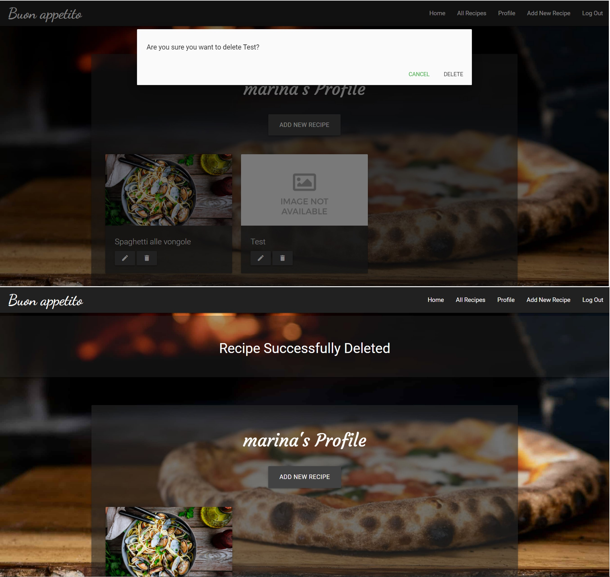

# Testing Functionality, Usability and Responsiveness

Functionality, Usability and Responsiveness of the key website elements were tested manually following the plan:

### Navigation bar:

  - The navbar automatically collapses at the lg (large) breakpoint (992px).

    

  - For not registered users, the navbar displays links only to 4 pages: *Home*, *All Recipes*, *Log In* and *Register*.
    The card on *Home* page displays 3 buttons: *View All Recipes*, *Log In* and *Register*.

    

  - A registered user can view additional buttons: *Profile*, *Add New Recipe*, *Log Out*.
    Buttons *Log In* and *Register* dissapper. 

    

  - All buttons of the navbar are clickable and open correct pages.

### Pages layout:

  - *Home* page rearranges correctly at certain breakpoints.

    

  - *All recipes* and *Profile* pages rearrange correctly at certain breakpoints.

    

  - *Log In* and *Register* pages rearrange correctly at certain breakpoints.

    

  - *Add New Recipe* and *Edit Recipe* pages rearrange correctly at certain breakpoints.

    

### *Register*, *Log In* and *Log Out* functionality
  
  - The user name and password should match a specific pattern: numbers, lower and uppercase letters; special characters are not allowed; should contain from 5 to 15 characters. If the input does not match a pattern, a message appears to help users.

    

  - When the account is successfully created, the user is redirected to his *Profile* page. The flash message is correctly displayed.

    

  - If the user tries to register an account with the username that already exists, the warning flash message appears.

    

  - The users with existing accounts can successfully log in through *Log In* page and be rediracted to their *Profile* page.

    

  - If the user, trying to log in, enters an incorrect username or/and password, the warning flash message appears.

    

  - If the user presses the *Log Out* button on Navbar, the user is redirected to the *Log In* page. The flash message is correctly displayed.

    

### All Recipes page

  - For not registered users:
      - all recipes are displayes (from all users),
      - there are no *Edit Recipe* and *Delete Recipe* buttons,
      - when clicking the recipe card, the recipe data is displayed, all data fields are proparly displayed.
        

  - For registered users (logged in):
      - all recipes are displayes (from all users),
      - there are *Edit Recipe* and *Delete Recipe* buttons,
      - when clicking the recipe card, the recipe data, *Edit Recipe* and *Delete Recipe* buttons are displayed, all data fields are proparly displayed.
        

### Profile page

  - When the user is logged in, he is rediracted to his *Profile* page. On the *Profile* page, only the recipes created but the user are displayed.
  - *Add New Recipe* button is displayed.
  - Recipes are displayed with *Edit Recipe* and *Delete Recipe* buttons.
  - When clicking the recipe card, the recipe data, *Edit Recipe* and *Delete Recipe* buttons are displayed, all data fields are proparly displayed.

    

### Add New Recipe

  - When clicking the button *Add New Recipe*, the user can fill in the form to create a new recipe.
  - If the user is not logged in, but enter url of *Add New Recipe* page, the user will be redirected to the *Log In* page.
  - The dropdown menu with categories is functioning well.
  - The input fields have helper messages.
  - When the input field is filled in correctly, the green text message appears; when the input field is filled in incorrectly, the red text appears.
  - If the user enter the ingredients and preparation data correctly (each ingredient and preparation step starting with a new line), it will be recorded and consequentely displayed correctly in a recipe card.
    
  - If the submit button *Add Recipe* is clicked, the new recipe will be added to the database (MongoDB), it will appear in your *Profile* and on the *All Recipes* page (and will be available for other users to view).
  - When the new recipe is added, the user is redirected to the *Profile* page and the flash message is displayed.
  - If the user does not provide a broken image url, the fallback image is displayed.
    
  - If the button *Cancel* is clicked, the user will be redirected back to his *Profile* page.
  
### Edit Recipe

  - If the logged in user click *Edit Recipe* button, he will be redirected to *Edit Recipe* page. 
  - The form is prefilled with the recipe data correctly.
  - The user can make changes and click *Save Changes* button. The data is modified in the database and can be seen in a recipe card.
  - If the user click *Cancel* button, the user is redirected to the *Profile* page.

    

### Delete Recipe 

  - If the logged in user click *Delete Recipe* button, the modal window will appear asking if the user is sure to delete a recipe. 
  - If the user click *Delete* button, the recipe will be deleted from the database and consequently from *AllRecipes* and *Profile* pages.
  - If the user click *Cancel* button, the user is redirected to the *Profile* page.
  - When the recipe is deleted, the user is redirected to the *Profile* page and the falsh message is displayed.

    

### Flash messages, defensive design and custom error pages

  - If the user, while being logged in, copy the link of his profile page, then logs out from his profile and paste that link in the address bar, the custom 500 error page will be displayed.

    

  - If the user, while being not logged in, has a link of the *Edit Recipe* page for any recipe, the user will be redirected to *Log In* page.

  - If the user deletes a recipe, then enter the url of that recipe in the address bar, the custom 404 error page will appear.

### Search

  