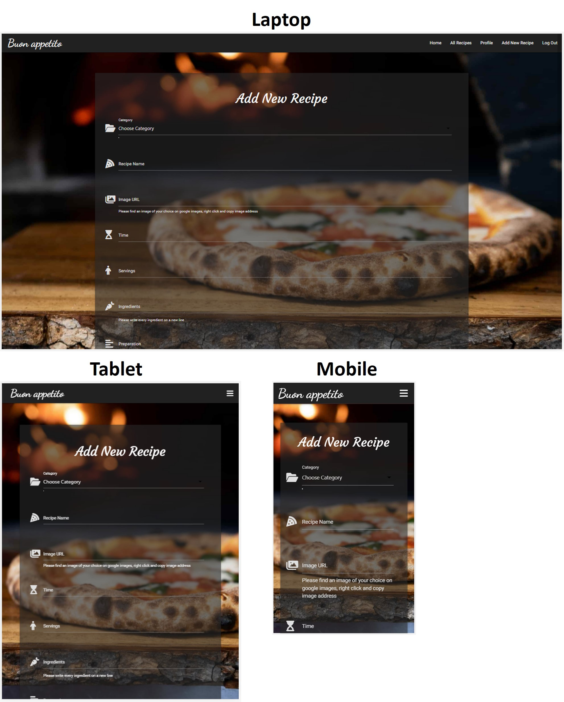

# Testing Functionality, Usability and Responsiveness

Functionality, Usability and Responsiveness of the key website elements were tested manually following the plan:

### Navigation bar:

  - The navbar automatically collapses at the lg (large) breakpoint (992px).

    

  - For not registered users, the navbar displays links only to 4 pages: *Home*, *All Recipes*, *Log In* and *Register*.
    The card on *Home* page displays 3 buttons: *View All Recipes*, *Log In* and *Register*.

    

  - A registered user can view additional buttons: *Profile*, *Add New Recipe*, *Log Out*.
    Buttons *Log In* and *Register* dissapper. 

    

  - All buttons of the navbar are clickable and open correct pages.

### Pages layout:

  - *Home* page rearranges correctly at certain breakpoints.

    

  - *All recipes* and *Profile* pages rearrange correctly at certain breakpoints.

    

  - *Log In* and *Register* pages rearrange correctly at certain breakpoints.

    

  - *Add New Recipe* and *Edit Recipe* pages rearrange correctly at certain breakpoints.

    

### *Register*, *Log In* and *Log Out* functionality
  
  - The user name and password should match a specific pattern: numbers, lower and uppercase letters; special characters are not allowed; should contain from 5 to 15 characters. If the input does not match a pattern, a message appears to help users.

    

  - When the account is successfully created, the user is redirected to his *Profile* page. The flash message is correctly displayed.

    

  - The users with existing accounts can successfully log in through *Log In* page and be rediracted to their *Profile* page.

    

  - If the user presses the *Log Out* button on Navbar, the user is redirected to the *Log In* page. The flash message is correctly displayed.

    

### Flash messages

