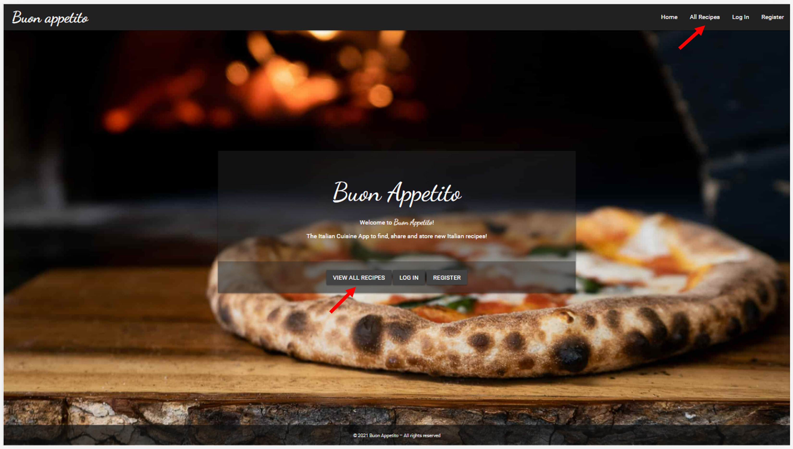
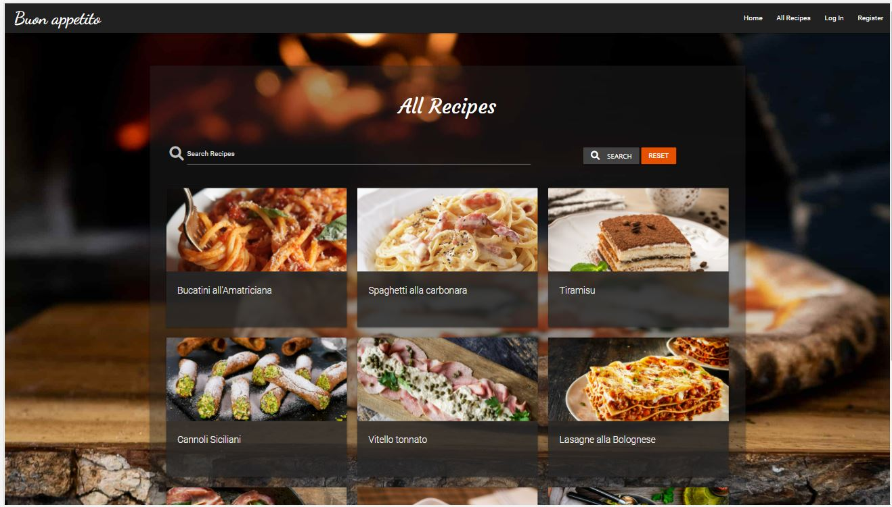
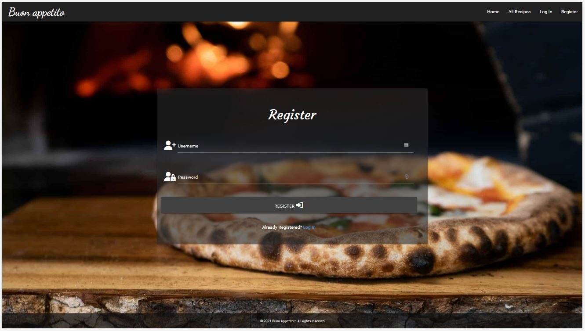
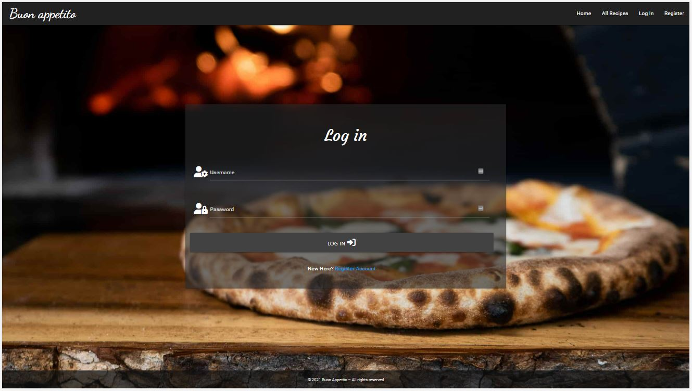
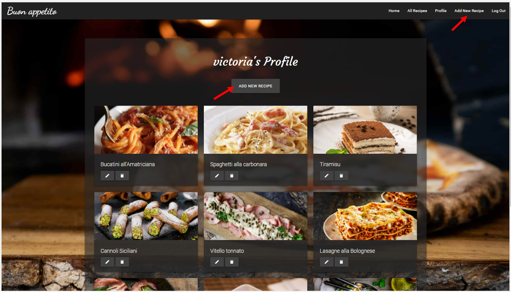
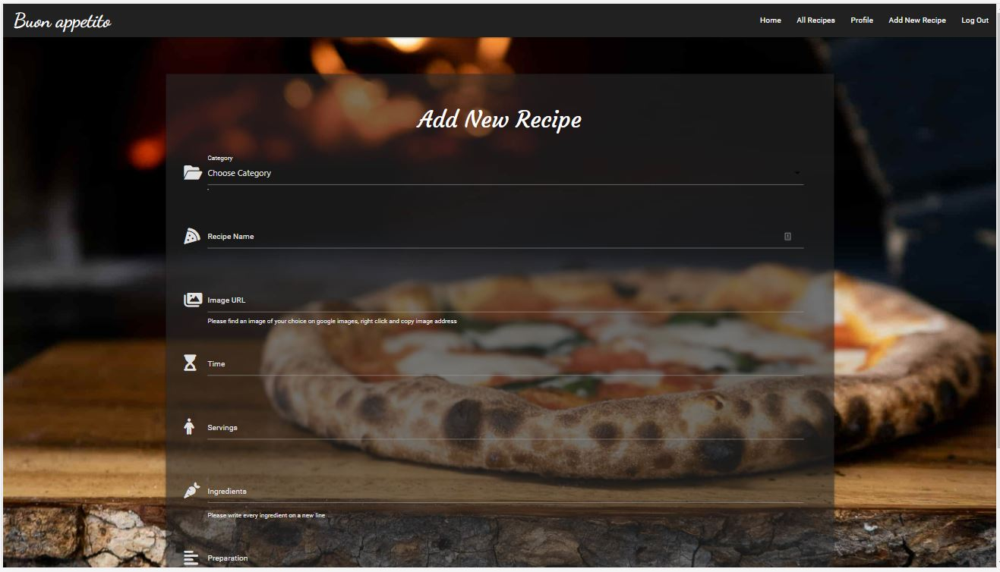
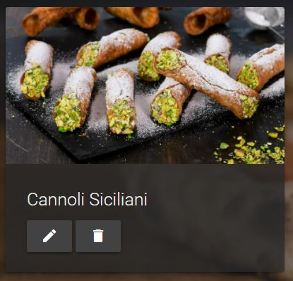
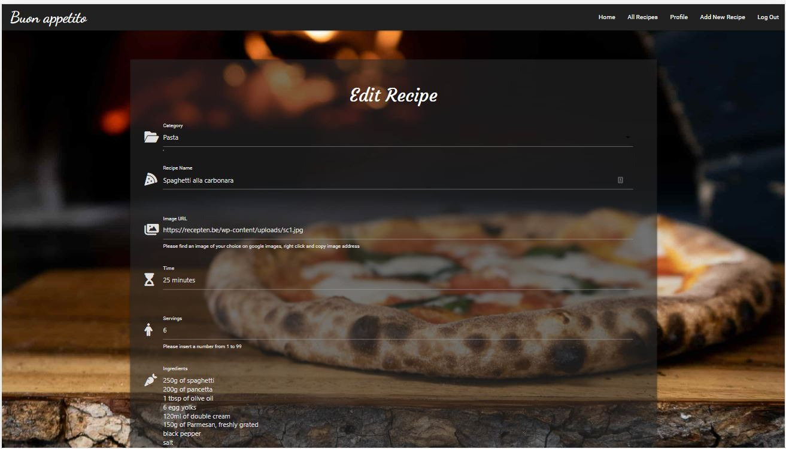
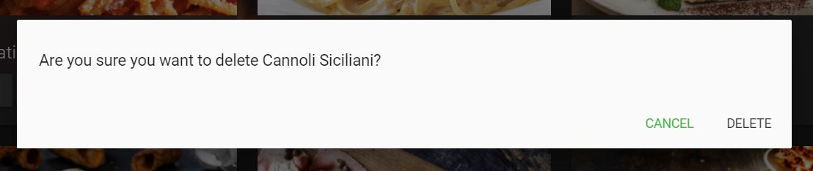
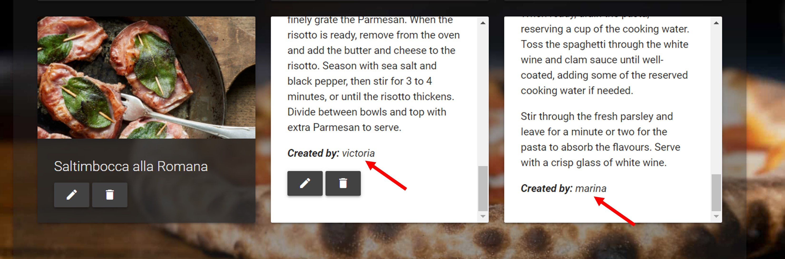

# Testing User Stories from User Experience (UX) Section

## I want to search for different recipes and get inspiration to try something new.
  
  - Upon entering the site, users are automatically greeted with a clean and easily readable navigation bar to go to the page of their choice. Underneath there is a full-screen background image with a Materialize card component that catches the user's attention and provides a button to go to *All Recipes* page.

    
  
  - *All Recipes* page displays a collections of different recipes. A search bar allows to refine the list of recipes.

    

## I want to be able to create my own recipes and store them in my profile. 
  
  - Users can create their own account on the *Register* page.

    
  
  - For already registered users there is an option to log in to their profile.

    
  
  - Once logged in, users can view their profile page and create new recipes by clicking *Add new recipe* button.

    
  
  - By clicking *Add new recipe* button, users can fill in a form with data for a new recipe.

    

## I want to organize my recipes (to create, edit and delete recipes).
  
  - Once a new recipe is added to the profile, there is a possibility to edit or delete it.

    
  
  - By clicking an *Edit* button, users can make changes in the recipe form.

    
  
  - By clicking a *Delete* button, users will be asked whether they are sure to delete a recipe.

    

## I want to share my own recipes with others.
  
  - Recipes of different users are displayed on *All Recipes" page. Users can view recipes of others.

    